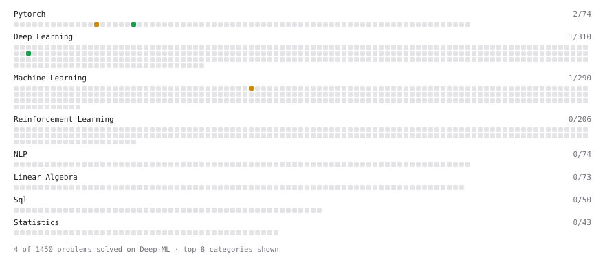

# Deep-ML

My machine learning practice from [Deep-ML](https://www.deep-ml.com). Every solution here was written by hand.

**10** solved · 10 problems · 0 labs · 0 math

[**Browse the interactive portfolio**](https://TheShy-dong.github.io/deep-ml/) to replay this filling in over time.

## Problems

| | Difficulty | Solved | |
| --- | --- | --- | --- |
| [Compare Naive vs Stable Softmax for Attention Scores](https://www.deep-ml.com/problems/962) | easy | 2026-09-25 | [solution](problems/0962-compare-naive-vs-stable-softmax-for-attention-scores) |
| [Implement LayerNorm from Scratch](https://www.deep-ml.com/problems/908) | easy | 2026-09-24 | [solution](problems/0908-implement-layernorm-from-scratch) |
| [Implement RMSNorm (Root Mean Square Layer Normalization)](https://www.deep-ml.com/problems/372) | easy | 2026-09-24 | [solution](problems/0372-implement-rmsnorm-root-mean-square-layer-normalization) |
| [Matrix-Vector Dot Product](https://www.deep-ml.com/problems/1) | easy | 2026-09-25 | [solution](problems/0001-matrix-vector-dot-product) |
| [Reshape Matrix](https://www.deep-ml.com/problems/3) | easy | 2026-09-25 | [solution](problems/0003-reshape-matrix) |
| [Scale Attention Scores by sqrt(d_k)](https://www.deep-ml.com/problems/963) | easy | 2026-09-25 | [solution](problems/0963-scale-attention-scores-by-sqrt-d-k) |
| [Softmax Activation Function Implementation ](https://www.deep-ml.com/problems/23) | easy | 2026-09-25 | [solution](problems/0023-softmax-activation-function-implementation) |
| [Batched Attention Score Computation for Multiple Heads](https://www.deep-ml.com/problems/966) | medium | 2026-09-25 | [solution](problems/0966-batched-attention-score-computation-for-multiple-heads) |
| [Implement BatchNorm2d from Scratch (training mode)](https://www.deep-ml.com/problems/902) | medium | 2026-09-24 | [solution](problems/0902-implement-batchnorm2d-from-scratch-training-mode) |
| [Implement Layer Normalization for Sequence Data](https://www.deep-ml.com/problems/109) | medium | 2026-09-24 | [solution](problems/0109-implement-layer-normalization-for-sequence-data) |

---

_This file is regenerated by Deep-ML on every push._
